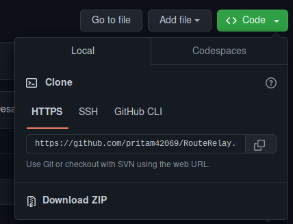
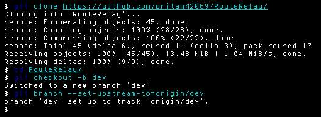
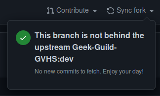
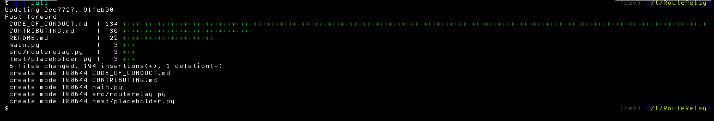
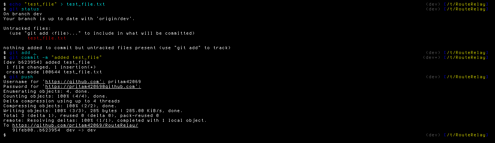
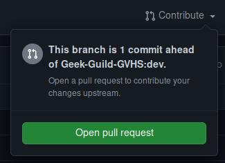

# Instructions for Contributing

## Cloning the Repository
1. Fork the Repository keeping "Copy the `main` branch only" option deselected.
2. In the forked Repository click on the Code option and copy the HTTPS git URL.

3. In your computer terminal type `git clone <copied link>`.
#### The Repository is cloned.

## Setting up the cloned Repository
1. Change the working directory in terminal by typing `cd RouteRelay`.
2. Change the branch to dev by typing `git checkout -b dev` in the terminal. All changes you do from now on should be done on dev branch only.
3. Now enter `git branch --set-upstream-to=origin/dev` in the terminal.

## Pulling updates before starting to work
1. Go to your forked repository on Github.com and sync fork on both the branches main and dev.

2. Now pull the changes to your local git repository by typing `git pull` in the terminal.

3. If any conflicts arise resolve them.

## Pushing the changes after work is done
1. Save everything after your work is done and type `git status` in the terminal.
2. Now check if only the changes you have made are reflected.
3. Type `git add .`.
4. Now commit the changes by typing `git commit -m <message>`.
5. Push the commits by typing `git push`

## Creating a pull request
1. Go to your forked repository and click on Contribute (which is right next to sync fork).
2. Click on open pull request and describe the changes you have made in the description box.

3. Now click on Create pull request.

#### Now your request will be checked and merged if everything is okay
